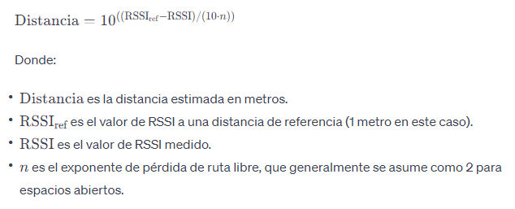

# Component BLE

the main code is in c_ble.c

The component scaning every 30 seconds and the window scan is 1 second

it reads the nearby devices and apply the FPSL (Free Space Path Loss) formula

We set RSSIref equal to -46, which is equivalent to 1 meter distance

And then we count only the devices that are within 10 meters. 