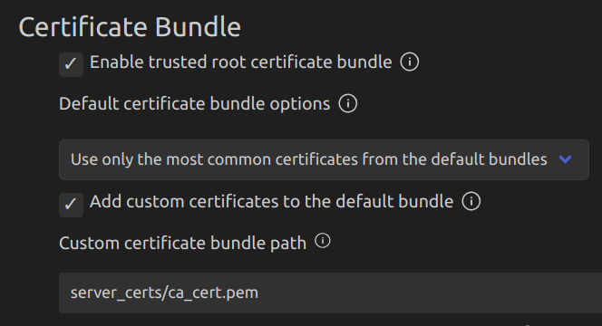

## To get the certificate of the server hosting the file(.bin)
```
openssl s_client -connect <ip>:443
```

### Example OUTPUT
```
$ openssl s_client -connect raw.githubusercontent.com:443

CONNECTED(00000003)
depth=2 C = US, O = DigiCert Inc, OU = www.digicert.com, CN = DigiCert Global Root CA
verify return:1
depth=1 C = US, O = DigiCert Inc, CN = DigiCert TLS RSA SHA256 2020 CA1
verify return:1
depth=0 C = US, ST = California, L = San Francisco, O = "GitHub, Inc.", CN = *.github.io
verify return:1
---
Certificate chain
 0 s:C = US, ST = California, L = San Francisco, O = "GitHub, Inc.", CN = *.github.io
   i:C = US, O = DigiCert Inc, CN = DigiCert TLS RSA SHA256 2020 CA1
   a:PKEY: rsaEncryption, 2048 (bit); sigalg: RSA-SHA256
   v:NotBefore: Feb 21 00:00:00 2023 GMT; NotAfter: Mar 20 23:59:59 2024 GMT
 1 s:C = US, O = DigiCert Inc, CN = DigiCert TLS RSA SHA256 2020 CA1
   i:C = US, O = DigiCert Inc, OU = www.digicert.com, CN = DigiCert Global Root CA
   a:PKEY: rsaEncryption, 2048 (bit); sigalg: RSA-SHA256
   v:NotBefore: Apr 14 00:00:00 2021 GMT; NotAfter: Apr 13 23:59:59 2031 GMT
---
Server certificate
-----BEGIN CERTIFICATE-----
MIIHEjCCBfqgAwIBAgIQBE1y13zdpwLdWmfyoju92TANBgkqhkiG9w0BAQsFADBP
MQswCQYDVQQGEwJVUzEVMBMGA1UEChMMRGlnaUNlcnQgSW5jMSkwJwYDVQQDEyBE
aWdpQ2VydCBUTFMgUlNBIFNIQTI1NiAyMDIwIENBMTAeFw0yMzAyMjEwMDAwMDBa
Fw0yNDAzMjAyMzU5NTlaMGcxCzAJBgNVBAYTAlVTMRMwEQYDVQQIEwpDYWxpZm9y
bmlhMRYwFAYDVQQHEw1TYW4gRnJhbmNpc2NvMRUwEwYDVQQKEwxHaXRIdWIsIElu
Yy4xFDASBgNVBAMMCyouZ2l0aHViLmlvMIIBIjANBgkqhkiG9w0BAQEFAAOCAQ8A
MIIBCgKCAQEAuLBgDhov8bGGS2TsEZ+meb7oh/GIxbRJmxC7yq/qr75UDHhDf8p7
TkVbCyQp8bsj/Bmkx2xwSXZT0wkjZbJIe7Ycqgca4nka+Xpe5xb4pkrVOaPiDfdX
7+34CHZbUtqL0OYebi/5D5lLalLKNOGkySAz05foenfFAxAmQYJhR6KvxFY/dqI4
y7JwrnJ6Q8F+J6Ne1uP256UwcL0qlid6e/tA0ld3ryMSJ0I6xgtqjL26Le4/nxXu
YlekppVQr0OwrHa44Q7Z/1bsdFCGtR+WLNGVBeW3BWeTTp7yWjgfp49DWt48V9pI
elDGiDgVyJcsLOz4OQk2vRmNA1ZBZgck4wIDAQABo4ID0DCCA8wwHwYDVR0jBBgw
FoAUt2ui6qiqhIx56rTaD5iyxZV2ufQwHQYDVR0OBBYEFI0CHHVazcamQXhpKMP3
qqeYO9W7MHsGA1UdEQR0MHKCCyouZ2l0aHViLmlvgglnaXRodWIuaW+CDCouZ2l0
aHViLmNvbYIKZ2l0aHViLmNvbYIOd3d3LmdpdGh1Yi5jb22CFyouZ2l0aHVidXNl
cmNvbnRlbnQuY29tghVnaXRodWJ1c2VyY29udGVudC5jb20wDgYDVR0PAQH/BAQD
AgWgMB0GA1UdJQQWMBQGCCsGAQUFBwMBBggrBgEFBQcDAjCBjwYDVR0fBIGHMIGE
MECgPqA8hjpodHRwOi8vY3JsMy5kaWdpY2VydC5jb20vRGlnaUNlcnRUTFNSU0FT
SEEyNTYyMDIwQ0ExLTQuY3JsMECgPqA8hjpodHRwOi8vY3JsNC5kaWdpY2VydC5j
b20vRGlnaUNlcnRUTFNSU0FTSEEyNTYyMDIwQ0ExLTQuY3JsMD4GA1UdIAQ3MDUw
MwYGZ4EMAQICMCkwJwYIKwYBBQUHAgEWG2h0dHA6Ly93d3cuZGlnaWNlcnQuY29t
L0NQUzB/BggrBgEFBQcBAQRzMHEwJAYIKwYBBQUHMAGGGGh0dHA6Ly9vY3NwLmRp
Z2ljZXJ0LmNvbTBJBggrBgEFBQcwAoY9aHR0cDovL2NhY2VydHMuZGlnaWNlcnQu
Y29tL0RpZ2lDZXJ0VExTUlNBU0hBMjU2MjAyMENBMS0xLmNydDAJBgNVHRMEAjAA
MIIBfgYKKwYBBAHWeQIEAgSCAW4EggFqAWgAdwB2/4g/Crb7lVHCYcz1h7o0tKTN
uyncaEIKn+ZnTFo6dAAAAYZ0gHV7AAAEAwBIMEYCIQCqfmfSO8MxeeVZ/fJzqqBB
p+VqeRDUOUBVGyTTOn43ewIhAJT0S27mmGUlpqNiDADP+Jo8C6kYHF+7U6TY74bH
XHAaAHYAc9meiRtMlnigIH1HneayxhzQUV5xGSqMa4AQesF3crUAAAGGdIB1agAA
BAMARzBFAiEAguB+XQVANBj2MPcJzbz+LBPrkDDOEO3op52jdHUSW3ICIF0fnYdW
qvdtmgQNSns13pAppdQWp4/f/jerNYskI7krAHUASLDja9qmRzQP5WoC+p0w6xxS
ActW3SyB2bu/qznYhHMAAAGGdIB1SgAABAMARjBEAiAT/wA2qGGHSKZqBAm84z6q
E+dGPQZ1aCMY52pFSfcw8QIgP/SciuZG02X2mBO/miDT2hCp4y5d2sc7FE5PThyC
pbMwDQYJKoZIhvcNAQELBQADggEBADekGxEin/yfyWcHj6qGE5/gCB1uDI1l+wN5
UMZ2ujCQoKQceRMHuVoYjZdMBXGK0CIXxhmiIosD9iyEcWxV3+KZQ2Xl17e3N0zG
yOXx2Kd7B13ruBxQpKOO8Ez4uGpyWb5DDoretV6Pnj9aQ2SCzODedvS+phIKBmi7
d+FM70tNZ6/2csdrG5xIU6d/7XYYXPD2xkwkU1dX4UKmPa7h9ZPyavopcgE+twbx
LxoOkcXsNb/12jOV3iQSDfXDI41AgtFc694KCOjlg+UKizpemE53T5/cq37OqChP
qnlPyb6PYIhua/kgbH84ltba1xEDQ9i4UYfOMiJNZEzEdSfQ498=
-----END CERTIFICATE-----
subject=C = US, ST = California, L = San Francisco, O = "GitHub, Inc.", CN = *.github.io
issuer=C = US, O = DigiCert Inc, CN = DigiCert TLS RSA SHA256 2020 CA1
---
No client certificate CA names sent
Peer signing digest: SHA256
Peer signature type: RSA-PSS
Server Temp Key: X25519, 253 bits
---
SSL handshake has read 3581 bytes and written 391 bytes
Verification: OK
---
New, TLSv1.3, Cipher is TLS_AES_128_GCM_SHA256
Server public key is 2048 bit
Secure Renegotiation IS NOT supported
Compression: NONE
Expansion: NONE
No ALPN negotiated
Early data was not sent
Verify return code: 0 (ok)
---
---
Post-Handshake New Session Ticket arrived:
SSL-Session:
    Protocol  : TLSv1.3
    Cipher    : TLS_AES_128_GCM_SHA256
    Session-ID: F49DEF90DDA5D38EEADF91EA82EECF9FBEB18AF2A236560991934715DDF4F61A
    Session-ID-ctx: 
    Resumption PSK: 57E577D05169503FD9C22D41B81DF8CFFEFACD592A143998F3BEFFFADA98CAFC
    PSK identity: None
    PSK identity hint: None
    SRP username: None
    TLS session ticket lifetime hint: 3600 (seconds)
    TLS session ticket:
    0000 - 5a 96 67 3a a9 29 20 72-c9 80 3d ef e0 79 41 15   Z.g:.) r..=..yA.
    0010 - 0e a9 fd 08 6a 8a 29 be-4e 44 dc be 54 75 95 2b   ....j.).ND..Tu.+
    0020 - f9 fc f5 39 15 5c 24 7b-7f ad 1e 3d 6d f2 ed ed   ...9.\${...=m...
    0030 - 64 ea 75 16 f1 71 16 22-9a 99 5f ca 8b 57 de 77   d.u..q.".._..W.w
    0040 - af 6b 88 45 17 ad 23 c2-63 d8 cc bf 4f b8 28 23   .k.E..#.c...O.(#
    0050 - de 5c 02 6b e6 da e2 a2-c0 ce 63 80 ca 5a 8d cd   .\.k......c..Z..
    0060 - 90 b3 1b 87 d8 56 ea 4e-ec 76 d0 a2 f8 75 2e cd   .....V.N.v...u..
    0070 - ca c5 bd d2 e5 0e 67 71-6d d7 c7 df 31 5a c2 9b   ......gqm...1Z..
    0080 - 20 4f 06 37 9c e9 51 c5-6b 2f 6f 0b ab 21 03 71    O.7..Q.k/o..!.q
    0090 - 11 85 b6 0c 06 c3 43 0d-cf 96 1b f8 d0 72 c7 a9   ......C......r..

    Start Time: 1704981581
    Timeout   : 7200 (sec)
    Verify return code: 0 (ok)
    Extended master secret: no
    Max Early Data: 0
---
read R BLOCK
closed
```

Just copy the text between *-----BEGIN CERTIFICATE-----* and *-----END CERTIFICATE-----*


## Project configuration to use the certificate

### Kconfig.projbuild

1. Add the **Com OTA Configuration** from this file [Kconfig.projbuild](../../../Kconfig.projbuild) to your Kconfig.
2. Add the certificate to the project: For example, in a folder named /server_certs
- ProjectRoot
  - /build
  - /components
  - /main
  - **/server_certs**
      - **ca_cert.pem**

3. Add this to /main's [CMakeLists.txt](../../../CMakeLists.txt):

```
EMBED_TXTFILES ${project_dir}/server_certs/ca_cert.pem
```

4. Select **CONFIG_MBEDTLS_CUSTOM_CERTIFICATE_BUNDLE** and add the custom cert path. In this case, *server_certs/ca_cert.pem*




5. About this HTTPS_OTA example:

<ins>Make sure CONFIG_OTA_USE_CERT_BUNDLE = 1</ins>

```
esp_http_client_config_t config = {
    .url = UPDATE_URL,
    #ifdef CONFIG_OTA_USE_CERT_BUNDLE
    .crt_bundle_attach = esp_crt_bundle_attach,
    #else
    .cert_pem = (char *)server_cert_pem_start,
    #endif 
    .event_handler = _http_event_handler,
    .keep_alive_enable = true,
    #ifdef CONFIG_OTA_FIRMWARE_UPGRADE_BIND_IF
    .if_name = &ifr,
    #endif
};

```