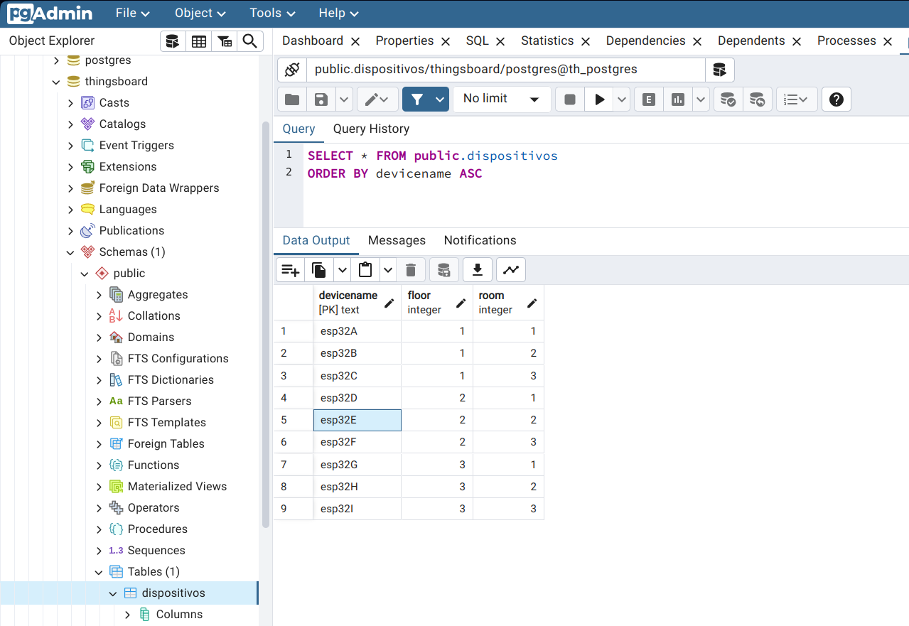

Este .py lanza un servidor http en localhost:9876 para interactuar con un database local postgresql.

Los tutoriales de instalación son todos para Ubuntu.

# Para instalar PostgreSQL
[Tutorial aquí](https://www.digitalocean.com/community/tutorials/how-to-install-and-use-postgresql-on-ubuntu-20-04)
```
$ sudo apt update
$ sudo apt install postgresql postgresql-contrib
$ sudo systemctl start postgresql.service
```

## Para configurar la BD Postgres
```
$ sudo -i -u postgres 
$ psql -h tu_ip -p 5432 -U postgres
```

Aquí creas la BD llamada thingsboard, la cual consultará el server http para encontrar el "contexto" según el nombre del esp32. Es decir, dependiendo del deviceName, te devuelve el piso y la sala donde se encuentra.

```
CREATE DATABASE thingsboard;

\c thingsboard

CREATE TABLE dispositivos (deviceName TEXT PRIMARY KEY, floor INTEGER, room INTEGER);

INSERT INTO dispositivos (deviceName, floor, room) VALUES ('esp32A', 1, 1), ('esp32B', 1, 2), ('esp32C', 1, 3), ('esp32D', 2, 1), ('esp32E', 2, 2), ('esp32F', 2, 3), ('esp32G', 3, 1), ('esp32H', 3, 2), ('esp32I', 3, 3);

SELECT * FROM dispositivos;

```

# Para arrancar el server http

```
$ python server.py
```

# Sintaxis de consulta: URL
Para hacer consultas al server, introduce los parámetros en la URL como se ve a continuación:

**[tu_ip]:9876/query?deviceName=[deviceName]**

| URL                                    | Respuesta                       |
|----------------------------------------|---------------------------------|
| 192.168.1.85:9876/query?deviceName=esp32A | {"deviceCtx": "1/1"}          |
| 192.168.1.85:9876/query?deviceName=asdas  | {"error": "texto de error"}   |

Introduce la URL de consulta en tu navegador para ver si todo funciona correctamente.

# pgAdmin: Gestión de la BD con una UI
Si quieres interactuar con la BD a través de una interfaz, instala pgAdmin. [Tutorial aquí](https://www.pgadmin.org/download/pgadmin-4-apt/)

